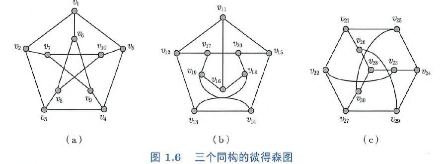
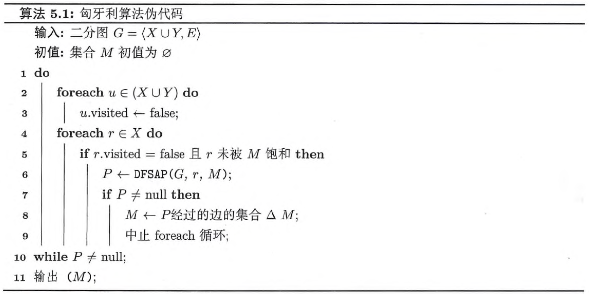
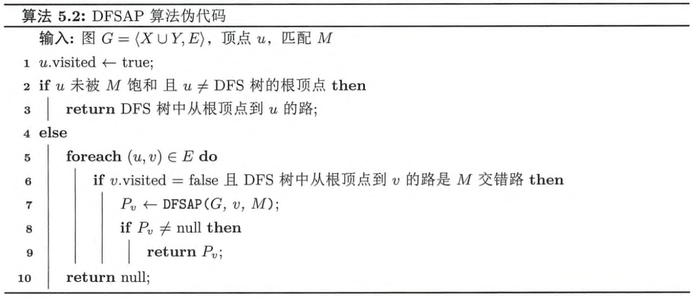
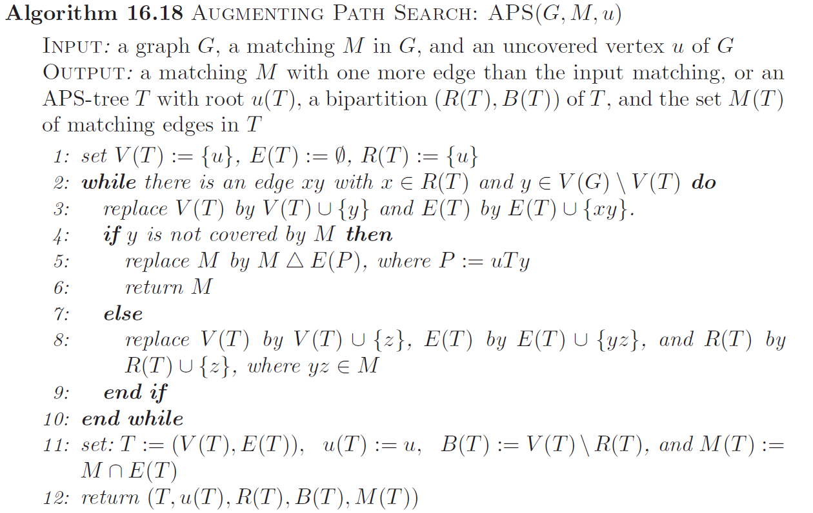

---
date:
  created: 2024-09-20
  updated: 2024-09-21
comments: true
---

# 图论笔记（五）

## 匹配和最大匹配

### 定义

**匹配(matching)**：图 $G$ 的边子集 $M \subseteq E$，$M$ 中的边两两不相邻  
**饱和(saturated)\\已匹配(matched)**：匹配 $M$ 中边的端点称为被 $M$ 饱和，或已匹配  
**极大匹配(maximal matching)**：不是任何图 $G$ 的匹配的真子集  
**最大匹配(maximum matching)**：边的数量最多的匹配  

### 思考题

???+ note "思考题 5.1  每个图都有匹配吗?"

    是的，考虑 $M = \emptyset$

又到了经典的 Peterson 时间

<!-- $$\operatorname{ker} f=\{g\in G:f(g)=e_{H}\}{\mbox{.}}$$

``` latex title="block syntax"
$$
\operatorname{ker} f=\{g\in G:f(g)=e_{H}\}{\mbox{.}}
$$
```

<div class="result" markdown>

$$
\operatorname{ker} f=\{g\in G:f(g)=e_{H}\}{\mbox{.}}
$$

</div>

The homomorphism $f$ is injective if and only if its kernel is only the
singleton set $e_G$, because otherwise $\exists a,b\in G$ with $a\neq b$ such
that $f(a)=f(b)$. -->

???+ note "思考题 5.2  图 1.6（a）所示的彼得森图的最大匹配有多少条边？"

    5 条. Peterson 图共 10 个顶点，匹配最多有 5 条边，同时 $M = \{v_1 v_6, v_2 v_7, v_3 v_8, v_4 v_9, v_5 v_{10}\}$ 是含有 5 条边的匹配
    

???+ note "思考题 5.3  阶为 $n$ 的图的最大匹配至多有多少条边？"

    至多有 $\lfloor \frac{n}{2} \rfloor$ 条边，我们用 $\operatorname{ends}(e)$ 表示边 $e$ 的端点组成的集合，则

    $$\Big|\bigcup_{e \in M} \operatorname{ends}(e)\Big| = \sum_{e \in M} |\operatorname{ends}(e)| = 2|M| \leq n$$

    故 $|M| \leq \lfloor \frac{n}{2} \rfloor$. 

???+ note "思考题 5.4  完全图 $K_n$ 的最大匹配有多少条边？"

    由上一小题我们知道 $K_n$ 最大匹配至多有 $\lfloor \frac{n}{2} \rfloor$ 条边.   
    设其顶点集 $V=\{v_1,v_2,...,v_n\}$，则 $M=\{v_1 v_2, v_3 v_4, ..., v_{2 \lfloor n / 2\rfloor - 1} v_{2 \lfloor n / 2\rfloor}\}$ 满足 $|M| = \lfloor \frac{n}{2} \rfloor$.   
    因此最大匹配恰有 $\lfloor \frac{n}{2} \rfloor$ 条边. 

???+ note "思考题 5.5  完全二分图 $K_{m,n}$ 的最大匹配有多少条边？"

    设对应的顶点集划分为 $X = \{x_1, x_2, ..., x_m\}, Y = \{y_1, y_2, ..., y_n\}$，其中 $|X|=m, |Y| = n$  
    由于 $M$ 中每一条边都有一个端点在 $X$ 中，若 $|M| > m$，根据鸽笼原理，必有两条边共享 $X$ 中的一个顶点，显然不可能，故 $|M| \leq m$. 同理 $|M| \leq n$，于是 $|M| \leq \min \{m, n\}$  
    令 $s = \min \{m,n\}$，则 $M = \{x_1 y_1, x_2 y_2, ..., x_s y_s\}$ 满足 $|M| = \min \{m, n\}$，即最大匹配有 $\min \{m, n\}$ 条边. 

???+ note "思考题 5.6  图的两个匹配的并集的边导出子图的每个连通分支的结构有什么特征？"

    在两个匹配的并集的边导出子图中，每个顶点的度要么是 1，要么是 2.  
    对于任意一个含有 $n'$ 个顶点的连通分支 $C$，度为 1 的顶点数目至多为 2，否则
    
    $$\epsilon (C) = \frac{1}{2}\sum_{v \in V(C)} d(v) < \frac{1}{2}[1 \times 2 + 2 \times (n' - 2)] = n'-1$$

    违背了 $C$ 连通的要求（见**练习 2.1**），另外，由于 $\sum_{v \in V(C)} d(v)$ 为偶数，度为 1 的顶点数只能是 0 或 2.   
    如果为 0，我们可以找到一条欧拉回路，这条回路不会重复经过任何点且包含了 $C$ 的所有边；   
    如果为 2，我们可以找到一条欧拉迹，同样不会重复经过任何点且包含了 $C$ 的所有边.   
    因此连通分支要么是一条路，要么是一个圈. 

说得好，但是对称差是什么

**Definition**  对称差（用 $\Delta$ 表示）定义为：$A \operatorname{\Delta} B = A \cup  B - A \cap B$

???+ note "思考题 5.7  图的两个匹配的对称差的边导出子图的每个连通分支的结构有什么特征？"

    似乎没什么区别（？，$M_1 \cap M_2$ 也是一个匹配，在 $M_1 \cup M_2$ 中删去这些边不改变度要么为 1 要么为 2 的事实（删到度为 0 的点不会在边导出子图中）

### 定义

给定图 $G = \langle V, E \rangle$ 以及匹配 $M$  
**交错路(alternating path)**：交替经过 $M$ 和 $E \setminus M$ 中的边的路  
**增广路(augmenting path)**：起点和终点未被匹配的交错路

???+ note "思考题 5.8  每个匹配都有交错路和增广路吗？若有，则唯一吗？"

    **交错路**：如果 $G$ 不为平凡图，只需任取一条边即为交错路；对于任意含有至少两条边的图 $G$，各取两个边即构成两条交错路  
    **增广路**：不一定有，例如

    $$V = \{v_1,v_2,v_3,v_4\}, \quad E = \{v_1 v_2, v_3 v_4\},\quad M=E$$

    有也不一定唯一，例如

    $$V = \{v_1,v_2,v_3,v_4\}, \quad E = \{v_1 v_2, v_2 v_3, v_3 v_4, v_1 v_3, v_2 v_4\},\quad M=\{v_2 v_3\}$$

    $v_1 v_2 v_3 v_4$ 以及 $v_1 v_3 v_2 v_4$ 均为增广路

???+ note "思考题 5.9  如何利用增广路得到一个更大的匹配？"

    设增广路经过的边的集合为 $P$，则 $M \Delta P$ 是一个更大的匹配  
    首先 $M \Delta P$ 仍是匹配，$M - P$ 的边不会相邻，$P - M$ 内的也不会相邻. 对于 $P - M$ 内的边，其中一端为 $P \cap M$ 中边的顶点，另一端为未匹配的顶点，因此 $P - M$ 中的边一定不会和 $M - P$ 中的边有公共点  
    其次 $|M \Delta P| > |M|$，由增广路的定义容易知道 $|P - M| = |P \cap M| + 1$，故 $|M \Delta P| = |M|+1$

???+ tip "贝尔热定理（Berge Theorem）"

    对于图 $G = \langle V, E \rangle$ 和匹配 $M \subseteq E$，$M$ 是最大匹配当且仅当 $G$ 不含 $M$ 增广路  
    A matching $M$ in a graph $G$ is a maximum matching if and only if $G$ contains no $M$-augmenting path.

<head>
    <meta charset="UTF-8">
    <meta name="viewport" content="width=device-width, initial-scale=1.0">
    <title>文字对齐</title>
    <style>
        .left {
            float: left;
        }
        .right {
            float: right;
        }
        .container {
            width: 100%;
            overflow: hidden; /* 清除浮动 */
        }
    </style>
</head>

???+ note "思考题 5.10  证明贝尔热定理"

    <div class="container">
        <span class="left">**前推后**：若 $M$ 是最大匹配且存在 $M$ 增广路，可利用**思考题 5.9**构造边数更多的匹配，矛盾   
        **后推前**：如果 $M$ 不是最大匹配，令 $M'$ 为一个最大匹配. 考虑 $H = G[M \Delta M']$，由于 $|M'|>|M|$，必存在 $H$ 的连通分支 $C$，$|E(C)\cap M| < |E(C)\cap M'|$，此时 $C$ 不可能是一个圈（否则有 $|E(C)\cap M| = |E(C)\cap M'|$），因此必为路. 同时这条路还是交错路，起点终点均为 $M'$ 匹配. 注意到起点终点的度均为 1，且唯一关联的边在 $M'$ 中，所以未被 $M$ 匹配，于是 $C$ 就正好是一条增广路. 
        <span class="right">$\square$</span>
    </div>

## 算法

### 匈牙利算法







???+ note "思考题 5.11  do-while 循环运行多少轮?"

    设最大匹配有 $m$ 条边，由于 $|M|$ 每轮增加 1，循环将会进行 $m$ 轮. 

???+ note "思考题 5.12  如何高效地判定 DFS 树从根顶点到顶点 $v$ 的路是 $M$ 交错路"

    可以去掉 DFS 树中一些不必要的分支，保证根顶点到树中其他任意顶点的路均为交错路  
    采用染色法，将根顶点染红色，DFS 进行过程中，我们安装如下规则更新顶点  
    如果当前顶点为红色，我们只扩展当前顶点的邻居中还未访问过的，将扩展的节点染为蓝色  
    如果当前顶点为蓝色，我们只扩展当前顶点的邻居中已经被 $M$ 匹配的，将扩展的节点染为红色  

**声明**：上一题对 DFS 树进行了裁剪，不一定覆盖 $G$ 中所有点，下面的证明中我将采用这个树

???+ note "思考题 5.13  当对顶点 $r$ 调用 DFSAP 算法返回 null 时，是否已尝试所有以 $r$ 为起点的 $M$ 交错路? 会遗漏 $M$ 增广路吗?"

    不会尝试所有交错路，如果有一个红色节点 $x$ 到一个蓝色节点 $y$ 有一条后向边，那么根节点到 $x$ 再到 $y$ 就是一条未尝试过的交错路  
    但不会遗漏增广路，我们约定以下几个记号

    - $R(T)$    DFS 树中被标记为红色的顶点
    - $B(T)$    DFS 树中被标记为蓝色的顶点
    - $N(X)$    顶点集 $X$ 中的点在图 $G$ 中所有的邻居
    
    我们注意到：
    
    - $B(T) \subseteq N(R(T))$，因为所有蓝色节点都由红色节点扩展而来；
    - $N(R(T)) \subseteq R(T) \cup B(T)$，这是由 DFS 性质决定的；
    - $N(R(T)) \cap R(T) = \emptyset$，这是因为 $G$ 是二分图，如果两个红色节点相邻会形成一个奇圈
    
    由上述三个结论我们知道 $N(R(T)) = B(T)$  
    假设有以 $u$ 为起点的增广路被遗漏，设该条路中第一个不在 $T$ 中的顶点为 $z$（这样的 $z$ 必定存在，因为路的终点不被 $M$ 匹配，必定不在树中），那么 $z$ 的前一个顶点 $w$ 只能是蓝色（$N(R(T)) = B(T)$），但蓝色节点应该扩展所有已匹配的邻居，所以 $z$ 未被匹配（即 $z$ 为终点）. 从 $u$ 到 $w$ 只有一条路，且最后一条边不属于 $M$，而 $wz$ 也不属于 $M$，显然与增广路的定义矛盾. 综上，不会遗漏增广路. 

???+ note "思考题 5.14  只从顶点子集 $X$ 中的顶点出发运行 DFSAP 算法会遗漏 $M$ 增广路吗?"

    不会，根据前面的说明，DFSAP 不会遗漏以 $X$ 中顶点为起点的增广路，假设遗漏了以 $Y$ 中顶点为起点的增广路 $P$，那么 $P$ 的终点一定在 $X$ 中（因为增广路的长度必为奇数），将 $P$ 倒过来就得到以 $X$ 中顶点为起点的增广路，矛盾

???+ note "思考题 5.15  证明匈牙利算法输出的集合 $M$ 是图 $G$ 的最大匹配"

    根据前面的思考题，我们知道 $M$ 始终是匹配，每经过一次 do-while 循环 $|M|$ 就加一，所以循环至多执行轮数等于最大匹配边数，算法会终止.   
    算法终止时，$P = \text{null}$ 说明不存在 $M$ 增广路，利用贝尔热定理知 $M$ 是最大匹配. 

### 霍普克罗夫特-卡普算法


## 本章小结

- **匹配(matching)**：图 $G$ 的边子集 $M \subseteq E$，$M$ 中的边两两不相邻  
- **饱和(saturated)\\已匹配(matched)**：匹配 $M$ 中边的端点称为被 $M$ 饱和，或已匹配  
- **极大匹配(maximal matching)**：不是任何图 $G$ 的匹配的真子集  
- **最大匹配(maximum matching)**：边的数量最多的匹配  
- **交错路(alternating path)**：交替经过 $M$ 和 $E \setminus M$ 中的边的路  
- **增广路(augmenting path)**：起点和终点未被匹配的交错路  
- **贝尔热定理(Berge Theorem)**：对于图 $G = \langle V, E \rangle$ 和匹配 $M \subseteq E$，$M$ 是最大匹配当且仅当 $G$ 不含 $M$ 增广路  