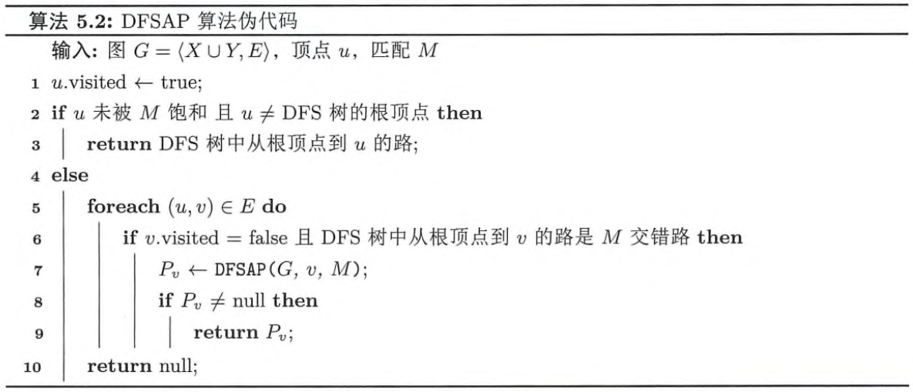

---
date:
  created: 2024-09-20
  updated: 2024-09-21
comments: true
header-includes:
  - \usepackage[ruled,vlined,linesnumbered]{algorithm2e}
---

# 图论笔记（五）

## 匹配和最大匹配

### 定义

**匹配(matching)**：图 $G$ 的边子集 $M \subseteq E$，$M$ 中的边两两不相邻  
**饱和(saturated)\\已匹配(matched)**：匹配 $M$ 中边的端点称为被 $M$ 饱和，或已匹配  
**极大匹配(maximal matching)**：不是任何图 $G$ 的匹配的真子集  
**最大匹配(maximum matching)**：边的数量最多的匹配  

### 思考题

???+ note "思考题 5.1  每个图都有匹配吗?"

    是的，考虑 $M = \emptyset$

又到了经典的 Peterson 时间

<!-- $$\operatorname{ker} f=\{g\in G:f(g)=e_{H}\}{\mbox{.}}$$

``` latex title="block syntax"
$$
\operatorname{ker} f=\{g\in G:f(g)=e_{H}\}{\mbox{.}}
$$
```

<div class="result" markdown>

$$
\operatorname{ker} f=\{g\in G:f(g)=e_{H}\}{\mbox{.}}
$$

</div>

The homomorphism $f$ is injective if and only if its kernel is only the
singleton set $e_G$, because otherwise $\exists a,b\in G$ with $a\neq b$ such
that $f(a)=f(b)$. -->

???+ note "思考题 5.2  图 1.6（a）所示的彼得森图的最大匹配有多少条边？"

    5 条. Peterson 图共 10 个顶点，匹配最多有 5 条边，同时 $M = \{v_1 v_6, v_2 v_7, v_3 v_8, v_4 v_9, v_5 v_{10}\}$ 是含有 5 条边的匹配
    

???+ note "思考题 5.3  阶为 $n$ 的图的最大匹配至多有多少条边？"

    至多有 $\lfloor \frac{n}{2} \rfloor$ 条边，我们用 $\operatorname{ends}(e)$ 表示边 $e$ 的端点组成的集合，则

    $$\Big|\bigcup_{e \in M} \operatorname{ends}(e)\Big| = \sum_{e \in M} |\operatorname{ends}(e)| = 2|M| \leq n$$

    故 $|M| \leq \lfloor \frac{n}{2} \rfloor$. 

???+ note "思考题 5.4  完全图 $K_n$ 的最大匹配有多少条边？"

    由上一小题我们知道 $K_n$ 最大匹配至多有 $\lfloor \frac{n}{2} \rfloor$ 条边.   
    设其顶点集 $V=\{v_1,v_2,...,v_n\}$，则 $M=\{v_1 v_2, v_3 v_4, ..., v_{2 \lfloor n / 2\rfloor - 1} v_{2 \lfloor n / 2\rfloor}\}$ 满足 $|M| = \lfloor \frac{n}{2} \rfloor$.   
    因此最大匹配恰有 $\lfloor \frac{n}{2} \rfloor$ 条边. 

???+ note "思考题 5.5  完全二分图 $K_{m,n}$ 的最大匹配有多少条边？"

    设对应的顶点集划分为 $X = \{x_1, x_2, ..., x_m\}, Y = \{y_1, y_2, ..., y_n\}$，其中 $|X|=m, |Y| = n$  
    由于 $M$ 中每一条边都有一个端点在 $X$ 中，若 $|M| > m$，根据鸽笼原理，必有两条边共享 $X$ 中的一个顶点，显然不可能，故 $|M| \leq m$. 同理 $|M| \leq n$，于是 $|M| \leq \min \{m, n\}$  
    令 $s = \min \{m,n\}$，则 $M = \{x_1 y_1, x_2 y_2, ..., x_s y_s\}$ 满足 $|M| = \min \{m, n\}$，即最大匹配有 $\min \{m, n\}$ 条边. 

???+ note "思考题 5.6  图的两个匹配的并集的边导出子图的每个连通分支的结构有什么特征？"

    在两个匹配的并集的边导出子图中，每个顶点的度要么是 1，要么是 2.  
    对于任意一个含有 $n'$ 个顶点的连通分支 $C$，度为 1 的顶点数目至多为 2，否则
    
    $$\epsilon (C) = \frac{1}{2}\sum_{v \in V(C)} d(v) < \frac{1}{2}[1 \times 2 + 2 \times (n' - 2)] = n'-1$$

    违背了 $C$ 连通的要求（见**练习 2.1**），另外，由于 $\sum_{v \in V(C)} d(v)$ 为偶数，度为 1 的顶点数只能是 0 或 2.   
    如果为 0，我们可以找到一条欧拉回路，这条回路不会重复经过任何点且包含了 $C$ 的所有边；   
    如果为 2，我们可以找到一条欧拉迹，同样不会重复经过任何点且包含了 $C$ 的所有边.   
    因此连通分支要么是一条路，要么是一个圈. 

说得好，但是对称差是什么

**Definition**  对称差（用 $\Delta$ 表示）定义为：$A \operatorname{\Delta} B = A \cup  B - A \cap B$

???+ note "思考题 5.7  图的两个匹配的对称差的边导出子图的每个连通分支的结构有什么特征？"

    似乎没什么区别（？，$M_1 \cap M_2$ 也是一个匹配，在 $M_1 \cup M_2$ 中删去这些边不改变度要么为 1 要么为 2 的事实（删到度为 0 的点不会在边导出子图中）

### 定义

给定图 $G = \langle V, E \rangle$ 以及匹配 $M$  
**交错路(alternating path)**：交替经过 $M$ 和 $E \setminus M$ 中的边的路  
**增广路(augmenting path)**：起点和终点未被匹配的交错路

???+ note "思考题 5.8  每个匹配都有交错路和增广路吗？若有，则唯一吗？"

    **交错路**：如果 $G$ 不为平凡图，只需任取一条边即为交错路；对于任意含有至少两条边的图 $G$，各取两个边即构成两条交错路  
    **增广路**：不一定有，例如

    $$V = \{v_1,v_2,v_3,v_4\}, \quad E = \{v_1 v_2, v_3 v_4\},\quad M=E$$

    有也不一定唯一，例如

    $$V = \{v_1,v_2,v_3,v_4\}, \quad E = \{v_1 v_2, v_2 v_3, v_3 v_4, v_1 v_3, v_2 v_4\},\quad M=\{v_2 v_3\}$$

    $v_1 v_2 v_3 v_4$ 以及 $v_1 v_3 v_2 v_4$ 均为增广路

???+ note "思考题 5.9  如何利用增广路得到一个更大的匹配？"

    设增广路经过的边的集合为 $P$，则 $M \Delta P$ 是一个更大的匹配  
    首先 $M \Delta P$ 仍是匹配，$M - P$ 的边不会相邻，$P - M$ 内的也不会相邻. 对于 $P - M$ 内的边，其中一端为 $P \cap M$ 中边的顶点，另一端为未匹配的顶点，因此 $P - M$ 中的边一定不会和 $M - P$ 中的边有公共点  
    其次 $|M \Delta P| > |M|$，由增广路的定义容易知道 $|P - M| = |P \cap M| + 1$，故 $|M \Delta P| = |M|+1$

???+ tip "贝尔热定理（Berge Theorem）"

    对于图 $G = \langle V, E \rangle$ 和匹配 $M \subseteq E$，$M$ 是最大匹配当且仅当 $G$ 不含 $M$ 增广路  
    A matching $M$ in a graph $G$ is a maximum matching if and only if $G$ contains no $M$-augmenting path.

<head>
    <meta charset="UTF-8">
    <meta name="viewport" content="width=device-width, initial-scale=1.0">
    <title>文字对齐</title>
    <style>
        .left {
            float: left;
        }
        .right {
            float: right;
        }
        .container {
            width: 100%;
            overflow: hidden; /* 清除浮动 */
        }
    </style>
</head>

???+ note "思考题 5.10  证明贝尔热定理"

    <div class="container">
        <span class="left">**前推后**：若 $M$ 是最大匹配且存在 $M$ 增广路，可利用**思考题 5.9**构造边数更多的匹配，矛盾   
        **后推前**：如果 $M$ 不是最大匹配，令 $M'$ 为一个最大匹配. 考虑 $H = G[M \Delta M']$，由于 $|M'|>|M|$，必存在 $H$ 的连通分支 $C$，$|E(C)\cap M| < |E(C)\cap M'|$，此时 $C$ 不可能是一个圈（否则有 $|E(C)\cap M| = |E(C)\cap M'|$），因此必为路. 同时这条路还是交错路，起点终点均为 $M'$ 匹配. 注意到起点终点的度均为 1，且唯一关联的边在 $M'$ 中，所以未被 $M$ 匹配，于是 $C$ 就正好是一条增广路. 
        <span class="right">$\square$</span>
    </div>

## 算法

### 匈牙利算法

匈牙利算法伪代码如下

<pre><code class="language-pseudocode">
\begin{algorithm}
\caption{Hungarian Algorithm}
\begin{algorithmic}
\Input A bipartite graph $G = \langle X \cup Y, E \rangle$
\Initialize $M \gets \emptyset$
\Procedure{Hungarian}{$G$}
    \Repeat
        \For {each vertex $u \in (X \cup Y)$}
            \State $u.\text{visited} \gets $ \false
        \EndFor
        \For {each $r \in X$}
            \If {$r.\text{visited} =$ \false$\text{ and } r \text{ is not matched}$}
                \State $P \gets$ \textsc{Dfsap}$(G, r, M)$
                \If {$P \neq $ null}
                    \State $M \gets \{e:e \text{ is an edge on }P\}\operatorname{\Delta} M$
                    \State $\textbf{break}$
                \EndIf
            \Endif
        \EndFor
    \Until{$P = $ null}
    \Return $M$
\EndProcedure
\end{algorithmic}
\end{algorithm}
</code></pre>

<pre><code class="language-pseudocode">
\begin{algorithm}
\caption{DFSAP Algorithm}
\begin{algorithmic}
\Input A bipartite graph $G = \langle X \cup Y, E \rangle$, vertex $u$ and matching $M$
\Procedure{Dfsap}{$G, u, M$}
    \State $u.\text{visited} \gets $ \true
    \If {$u$ is not matched and $u$ is not the root of DFS tree}
        \Return the path from the root to $u$ in DFS tree
    \Else
        \For {each $(u, v) \in E$}
            \If {$v.\text{visited} = $ \false and $(u \in X$ xor $(u, v) \in M)$}
                \State $P_v \gets$ \textsc{Dfsap}$(G, v, M)$
                \If {$P_v \neq $ null}
                    \Return $P_v$
                \EndIf
            \EndIf
        \EndFor
        \Return null
    \EndIf
\EndProcedure
\end{algorithmic}
\end{algorithm}
</code></pre>

<!--  -->

<!-- 

 -->

???+ note "思考题 5.11  do-while 循环运行多少轮?"

    设最大匹配有 $m$ 条边，由于 $|M|$ 每轮增加 1，循环将会进行 $m$ 轮. 

???+ note "思考题 5.12  如何高效地判定 DFS 树从根顶点到顶点 $v$ 的路是 $M$ 交错路"

    可以去掉 DFS 树中一些不必要的分支，保证根顶点到树中其他任意顶点的路均为交错路  
    采用染色法，将根顶点染红色，DFS 进行过程中，我们安装如下规则更新顶点  
    如果当前顶点为红色，我们只扩展当前顶点的邻居中还未访问过的，将扩展的节点染为蓝色  
    如果当前顶点为蓝色，我们只扩展当前顶点的邻居中已经被 $M$ 匹配的，将扩展的节点染为红色  

**声明**：上一题对 DFS 树进行了裁剪，不一定覆盖 $G$ 中所有点，下面的证明中我将采用这个树

???+ note "思考题 5.13  当对顶点 $r$ 调用 DFSAP 算法返回 null 时，是否已尝试所有以 $r$ 为起点的 $M$ 交错路? 会遗漏 $M$ 增广路吗?"

    不会尝试所有交错路，如果有一个红色节点 $x$ 到一个蓝色节点 $y$ 有一条后向边，那么根节点到 $x$ 再到 $y$ 就是一条未尝试过的交错路  
    但不会遗漏增广路，我们约定以下几个记号

    - $R(T)$    DFS 树中被标记为红色的顶点
    - $B(T)$    DFS 树中被标记为蓝色的顶点
    - $N(X)$    顶点集 $X$ 中的点在图 $G$ 中所有的邻居
    
    我们注意到：
    
    - $B(T) \subseteq N(R(T))$，因为所有蓝色节点都由红色节点扩展而来；
    - $N(R(T)) \subseteq R(T) \cup B(T)$，这是由 DFS 性质决定的；
    - $N(R(T)) \cap R(T) = \emptyset$，这是因为 $G$ 是二分图，如果两个红色节点相邻会形成一个奇圈
    
    由上述三个结论我们知道 $N(R(T)) = B(T)$  
    假设有以 $u$ 为起点的增广路被遗漏，设该条路中第一个不在 $T$ 中的顶点为 $z$（这样的 $z$ 必定存在，因为路的终点不被 $M$ 匹配，必定不在树中），那么 $z$ 的前一个顶点 $w$ 只能是蓝色（$N(R(T)) = B(T)$），但蓝色节点应该扩展所有已匹配的邻居，所以 $z$ 未被匹配（即 $z$ 为终点）. 增广路中 $w$ 到 $u$ 的部分边数为偶数，而树中 $w$ 到 $u$ 的路为奇数，这会构成一个奇圈，与 $G$ 为二分图矛盾. 

???+ note "思考题 5.14  只从顶点子集 $X$ 中的顶点出发运行 DFSAP 算法会遗漏 $M$ 增广路吗?"

    不会，根据前面的说明，DFSAP 不会遗漏以 $X$ 中顶点为起点的增广路，假设遗漏了以 $Y$ 中顶点为起点的增广路 $P$，那么 $P$ 的终点一定在 $X$ 中（因为增广路的长度必为奇数），将 $P$ 倒过来就得到以 $X$ 中顶点为起点的增广路，矛盾

???+ note "思考题 5.15  证明匈牙利算法输出的集合 $M$ 是图 $G$ 的最大匹配"

    根据前面的思考题，我们知道 $M$ 始终是匹配，每经过一次 do-while 循环 $|M|$ 就加一，所以循环至多执行轮数等于最大匹配边数，算法会终止.   
    算法终止时，$P = \text{null}$ 说明不存在 $M$ 增广路，利用贝尔热定理知 $M$ 是最大匹配. 

匈牙利算法的时间复杂度为 $O(n(n+m))$. 

### Hopcroft-Karp 算法

<!-- $$
\begin{array}{ll}
1 & \textbf{Input. } \text{An array } A \text{ consisting of }n\text{ elements.} \\
2 & \textbf{Output. } A\text{ will be sorted in nondecreasing order stably.} \\
3 & \textbf{Method. }  \\
4 & flag\gets True\\
5 & \textbf{while }flag\\
6 & \qquad flag\gets False\\
7 & \qquad\textbf{for }i\gets1\textbf{ to }n-1\\
8 & \qquad\qquad\textbf{if }A[i]>A[i + 1]\\
9 & \qquad\qquad\qquad flag\gets True\\
10 & \qquad\qquad\qquad \text{Swap } A[i]\text{ and }A[i + 1]
\end{array}
$$ -->
伪代码如下：

$$
\begin{array}{ll}
1 & M = \emptyset\\
2 & \textbf{repeat}\\
3 & \qquad \text{let }\mathscr{P}=\{P_1,P_2,...,P_k\} \text{ be a maximal set of vertex-disjoint 
shortest $M$-augmenting paths}\\
4 & \qquad M=M\operatorname{\Delta}\,\,(P_1 \cup P_2 \cup \cdots \cup P_k)\\
5 & \textbf{until}\ \mathscr{P}=\emptyset\\
6 & \textbf{return}\ M
\end{array}
$$

注意这里 $\mathscr{P}$ 只需要是极大的就能达到 $O(\sqrt{|V|})$ 的循环轮数，未必需要最大

设 $G = \langle L \cup R, E \rangle$ 为二分图，$M$ 是一个匹配，找出 $\mathscr{P}$ 需要三步    
**Step1.** 新建一个有向图 $G_M = \langle V, E_M \rangle$，其中  
$E_M = \{(l, r):l\in L, r\in R, (l, r)\in E-M\}\cup\{(r,l):l\in L, r\in R, (l,r)\in M\}$  
**Step2.** 从 $\{l:l\in L\text{ and }l\text{ is not matched by }M\}$ 出发对 $G_M$ 应用 BFS，设 $q$ 为 BFS 找到 $R$ 中未被匹配的点的最小深度，则 BFS 的深度超过 $q$ 时就可以终止，最后得到 BFS 的图记为 $H$  
**Step3.** 对 $H^T$（将 $H$ 中箭头反向）最后一层的未匹配的节点应用 DFS 寻找增广路

算法的复杂度分析如下


### 花算法

???+ note "思考题 5.16 为什么二分图不存在上述问题?"

    因为这会导致奇圈，见思考题 5.13

## 完美匹配

### 定义

**完美匹配**：$M$ 饱和顶点集中的所有顶点  
$N(V'):=\{v:\exists u \in V', uv \in E\}$

???+ note "思考题 5.21  完美匹配一定是最大匹配吗？最大匹配一定是完美匹配吗？"

    完美匹配一定是最大匹配，反之不一定

???+ note "思考题 5.22  每个图都有完美匹配吗？完美匹配存在的必要条件有哪些？"

    不一定，首先图的阶为偶数

???+ note "思考题 5.23  图1.6（a）所示的彼得森图有完美匹配吗？"

    有，$M = \{v_1 v_6, v_2 v_7, v_3 v_8, v_4 v_9, v_5 v_{10}\}$
    

???+ note "思考题 5.24  阶为n的图的完美匹配有多少条边？"

    $n / 2$

???+ note "思考题 5.25  偶数阶完全图 $K_{2n}$ 一定有完美匹配吗？若有，则最多有多少个两两不相交的完美匹配？"

    一定有，最多有 $\frac{2n(2n-1)/2}{n} = (2n-1)$ 个不相交的完美匹配。  
    事实上，令 $V = \{v_1, v_2, ..., v_{2n}\}$，

    $$M_{k} = \{v_{i} v_{(i+\lceil k/2 \rceil) \operatorname{mod} n}:i=1,2,...,n, i \equiv k (\operatorname{mod} 2)\}\quad (k = 1,2,...,2k-1)$$

    是 $2k - 1$ 个相互无公共边的完美匹配

???+ note "思考题 5.26  偶数阶非空正则图一定有完美匹配吗？"

    不一定，见如下的 Sylvester 图  
    

???+ note "思考题 5.27  偶数阶欧拉图和偶数阶哈密尔顿图一定有完美匹配吗？"

    偶数阶欧拉图不一定有，例如  
      
    但偶数阶哈密尔顿图一定有，只需取哈密尔顿圈上不相邻的 $n / 2$ 条边即可

<!-- <script type="text/tikz">
    \begin{tikzpicture}
    \node[shape=circle,fill=lightgray](a) at (0, 0) {$v_1$};
    \node[shape=circle,fill=lightgray](b) at (1.5, 1) {$v_2$};
    \node[shape=circle,fill=lightgray](c) at (1.5,-1) {$v_3$};
    \node[shape=circle,fill=lightgray](d) at (3, 0) {$v_4$};
    \node[shape=circle,fill=lightgray](e) at (4.5, 1) {$v_5$};
    \node[shape=circle,fill=lightgray](f) at (4.5,-1) {$v_6$};
    \node[shape=circle,fill=lightgray](g) at (6, 0) {$v_6$};
    \node[shape=circle,fill=lightgray](h) at (7.5, 1) {$v_7$};
    \node[shape=circle,fill=lightgray](i) at (7.5,-1) {$v_8$};
    \node[shape=circle,fill=lightgray](j) at (9, 0) {$v_9$};
    \draw[-,very thick,lightgray] (a)-- (b);
    \draw[-,very thick,lightgray] (a)-- (c);
    \draw[-,very thick,lightgray] (c)-- (d);
    \draw[-,very thick,lightgray] (b)-- (d);
    \draw[-,very thick,lightgray] (d)-- (e);
    \draw[-,very thick,lightgray] (d)-- (f);
    \draw[-,very thick,lightgray] (e)-- (g);
    \draw[-,very thick,lightgray] (f)-- (g);
    \draw[-,very thick,lightgray] (g)-- (h);
    \draw[-,very thick,lightgray] (g)-- (i);
    \draw[-,very thick,lightgray] (h)-- (j);
    \draw[-,very thick,lightgray] (i)-- (j);
    \end{tikzpicture}
</script> -->

???+ note "思考题 5.28  图的两个完美匹配的对称差的边导出子图的每个连通分支的结构有什么特征？"

    均为圈，设 $M_1$ 和 $M_2$ 为两个完美匹配，$H = G[M_1 \operatorname{\Delta} M_2]$，$C$ 为 $H$ 的一个连通分支  
    对于 $C$ 中的点 $u$，$u$ 在 $M_1$ 中关联的边和在 $M_2$ 中关联的边不同，否则 $u$ 的度为 0，矛盾. 因此 $u$ 的度为 2，所以 $C$ 为一个圈. 

???+ note "思考题 5.29  树一定有完美匹配吗？若有，则最多有多少个完美匹配？"

    不一定，考虑 $P_3$  
    若有，则至多一个，否则两个完美匹配取对称差产生圈

### Hall 定理

!!! tip "霍尔定理(Hall's theorem)"

    对于二分图 $G = \langle X \cup Y, E \rangle$，$G$ 有饱和顶点子集 $X$ 中所有顶点的匹配当且仅当对于任意顶点子集 $S \subseteq X$，$|N(S)| \geq |S|$.   
    A bipartite graph $G := G[X, Y]$ has a matching which covers every vertex in $X$ if and only if

    $$|N(S)| \geq |S| \text{ for all } S \subseteq X$$

???+ note "思考题 5.30  证明 Hall 定理"

    令 $G = \langle X \cup Y, E \rangle$，若存在匹配 $M$ 饱和 $X$ 中所有点，那么 $X$ 中每一个点都与 $Y$ 中一个点匹配，并且它们两两不同，于是 $|N(X)| \geq |X|$.  
    反过来，如果不存在匹配饱和 $X$ 中所有顶点，令 $M'$ 为最大匹配，存在 $u \in X$ 未被 $M'$ 匹配. 令 $Z$ 为以 $u$ 为起点的 $M'$ 交错路可到达的所有顶点，由于 $M'$ 为最大匹配，故 $Z$ 中只有一个未被匹配的点 $u$. 设 $R = X \cap Z, B = Y \cap Z$，于是 $M'$ 匹配 $R - \{u\}$ 和 $B$ 中的点，因此

    $$|N(R)| = |B| = |R|-1<|R|$$

    霍尔定理成立. 

此处再给出几个推论

!!! abstract "推论 1"

    任意二分图 $G = \langle X \cup Y, E \rangle$ 有完美匹配当且仅当 $|X| = |Y|$ 且对于任意 $S \subseteq X$，$|N(S)| \geq |S|$.   
    **证明**：若 $G$ 有完美匹配，则匹配中任意一条边都是一端在 $X$ 中，一端在 $Y$ 中，必须 $|X| = |Y|$，后半句利用 Hall 定理即可.  
    反之，若 $|X| = |Y|$ 且对于任意 $S \subseteq X$，$|N(S)| \geq |S|$，则存在匹配 $M$ 饱和 $X$ 中所有点，每个 $X$ 中的点均与一个 $Y$ 中的点匹配，且他们互不相同，而 $|X|=|Y|$，所以 $Y$ 中所有点也被饱和. 

!!! abstract "推论 2"

    任意非空正则二分图均有完美匹配.   
    **证明**：设 $G = \langle X\cup Y, E \rangle$ 为非空 $r$ 正则二分图，于是 $|E|=r|X|=r|Y|$，即 $|X|=|Y|$.  
    令 $S$ 为 $X$ 的任意子集，$E_1$ 为 $S$ 中点关联的边组成的集合，$E_2$ 为 $N(S)$ 中点关联的边组成的集合，于是 $E_1 \subseteq E_2$，我们有

    $$r |S| = |E_1| \leq |E_2| = r|N(S)|$$

    由于 $k \geq 1$，故 $|N(S)| \geq |S|$，由**推论 1**知 $G$ 有完美匹配. 

???+ note "思考题 5.31  非空 $r$ 正则二分图一定有完美匹配吗？若有，则最多有多少个两两不相交的完美匹配？"

    一定有完美匹配，最多有 $\frac{nr}{n}=r$ 个，并且此界可以达到，令 $X = \{x_1, ..., x_n\}, Y = \{y_1, ..., y_n\}$，取

    $$\begin{gather*}
        M_k = \{x_i y_{(i+k-1) \operatorname{mod} n:i = 1,2,...,n}\}\quad (k = 1,2,...,r) \\ 
        E = \bigcup_{i = 1}^{r} M_i
    \end{gather*}$$

    则 $M_1, ..., M_r$ 恰为 $r$ 个两两不交的完美匹配. 

???+ note "思考题 5.32  完全二分图 $K_{n,n}$ 一定有完美匹配吗？若有，则最多有多少个两两不相交的完美匹配？"

    有，最多 $n$ 个

### Tutte 定理

$o(G)$：$G$ 中奇数阶连通分支的数量

!!! tip "塔特定理(Tutte's theorem)"

    对于图 $G = \langle V, E \rangle$，$G$ 有完美匹配当且仅当对于任意顶点子集 $S \subseteq V$，$o(G-S) \leq |S|$.  

???+ note "思考题 5.33 (Peterson's Theorem)  2 边连通的 3 正则图有完美匹配"

    设 $G = \langle V, E \rangle$ 为 2 边连通的 3 正则图，$S$ 为 $V$ 的真子集，$G_1, G_2, ..., G_k$ 为 $G-S$ 的奇数阶连通分支  
    若 $S = \emptyset$，$G-S$ 的所有连通分支阶数均为偶数，否则存在奇数阶连通分支 $C$

    $$\sum_{v \in C} d(v) = 3 \nu(C) \equiv 1 (\operatorname{mod} 2)$$

    矛盾  
    若 $S \neq \emptyset$，记 $E_i = \{u v: u\in V(G_i), v\in S, u v \in E\}, d(G_i) = |E_i|$，则

    $$2\epsilon(G_i) = \sum_{v \in V(G_i)}d(v) - d(G_i) = 3\nu(G_i)-d(G_i)\equiv 0(\operatorname{mod} 2)$$

    因此 $d(G_i)$ 为奇数，$d(G_i) \geq 1$，又因为 $G$ 是 2 边连通的，$d(G_i) \neq 1$，即 $d(G_i) \geq 3$.   
    
    $$3|S|=\sum_{v\in S}d(v) \geq |\bigcup_{i = 1}^{k} E_i| = \sum_{i = 1}^{k} d(G_i)\geq 3k$$

    于是 $|S|\geq k = o(G-S)$，利用 Tutte 定理知 $G$ 有完美匹配. 

???+ note "思考题 5.34  偶数阶 $(k-1)$ 边连通的 $k$ 正则图一定有完美匹配吗？"

    本题与上题基本类似，就不在详细证明. 

Menger、Hall、Tutte 可以相互推导，有时间会补上推导. 

本章暂未完成的内容：

1. Hopcroft-Krap 算法时间复杂度证明
2. Blossom 算法
3. Tutte 定理证明

## 本章小结

- **匹配(matching)**：图 $G$ 的边子集 $M \subseteq E$，$M$ 中的边两两不相邻  
- **饱和(saturated)\\已匹配(matched)**：匹配 $M$ 中边的端点称为被 $M$ 饱和，或已匹配  
- **极大匹配(maximal matching)**：不是任何图 $G$ 的匹配的真子集  
- **最大匹配(maximum matching)**：边的数量最多的匹配  
- **交错路(alternating path)**：交替经过 $M$ 和 $E \setminus M$ 中的边的路  
- **增广路(augmenting path)**：起点和终点未被匹配的交错路  
- **贝尔热定理(Berge Theorem)**：对于图 $G = \langle V, E \rangle$ 和匹配 $M \subseteq E$，$M$ 是最大匹配当且仅当 $G$ 不含 $M$ 增广路  