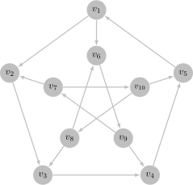

---
date:
  created: 2024-10-22
  updated: 2024-10-22
comments: true
---

# 图论笔记（七）

## 有向图的定义

**有向图**（directed graph）是一个二元组，记作 $G = \langle V, A \rangle$，其中：

- $V$ 是顶点的有限集合
- $A$ 是**有向边**（directed edge）的有限集合，有向边又称**弧**（arc），$A$ 中的每条弧均为由顶点组成的有序对

对于弧 $a = \langle v_i, v_j \rangle$，$v_i$ 为弧的**尾**（tail），$v_j$ 为弧的**头**（head），统称**端点**  
**入弧**（imcoming arc）：一条弧为其头的入弧  
**出弧**（imcoming arc）：一条弧为其尾的出弧  
**相邻**（adjacent）：弧的两个端点相邻，有公共端点的两条弧称作相邻  
**入邻点**（in-neighbor）：尾是头的入邻点  
**出邻点**（in-neighbor）：头是尾的出邻点  

**重弧**（multiple arcs）：头尾完全相同的两条弧，又称平行弧（parallel arcs）  
**反向弧**（inverse arc）：头尾相反的两条弧互为反向弧  
**自环**（loop）：两个端点相同的弧  
**简单有向图**（simple directed graph）：不含自环和重弧的有向图  

**阶**（order）：有向图 $G$ 的顶点数量 $|V|$，记作 $\nu (G)$  
**弧数**（size）：$G$ 的弧的数量 $|A|$，记作 $\epsilon (G)$  

???+ note "思考题 7.1  阶为 $n$ 的简单有向图的弧数的上界是多少？"

    $n(n - 1)$

**完全有向图**（complete directed graph）：简单有向图的每对顶点间都关联一条反向边

???+ note "思考题 7.2  完全有向图的弧数是多少？"

    $n(n - 1)$

**入度**（indegree）：顶点 $v$ 关联的入弧数量，记作 $d^-(v)$  
**出度**（outdegree）：顶点 $v$ 关联的出弧数量，记作 $d^+(v)$  
**度**（degree）：顶点 $v$ 的入度出度之和，记作 $d(v)$  

???+ tip "定理"

    对于任意一个有向图 $G = \langle V, E \rangle$，顶点集所有顶点的入度和和出度和均等于 $G$ 的弧数
    $$
    \sum_{v \in V} d^-(v) = \sum_{v \in V} d^+(v) = \epsilon(G)
    $$
    **证明**：在计算入度和时，每条边恰好被计数一次；在计算出度和时，每条边恰好被计数一次，因此定理成立. 

???+ abstract "推论"

    对于任意一个有向图 $G = \langle V, E \rangle$，顶点集 $V$ 中的所有顶点的度和等于 $G$ 的弧数的 2 倍
    $$
    \sum_{v \in V} d(v) = 2 \epsilon(G)
    $$
    **证明**：由定理有
    $$
    \sum_{v \in V} d(v) = \sum_{v \in V} d^-(v) + \sum_{v \in V} d^+(v) = 2 \epsilon(G)
    $$

**入度序列**（indegree sequence）：有向图 $G$ 中所有顶点的入度组成的非增序列  
**最大入度**（maximum indegree）：入度序列中的最大值，记作 $\Delta^- (G)$  
**最小入度**（minimum indegree）：入度序列中的最小值，记作 $\delta^- (G)$  
**出度序列**（outdegree sequence）：有向图 $G$ 中所有顶点的出度组成的非增序列  
**最大出度**（maximum outdegree）：出度序列中的最大值，记作 $\Delta^+ (G)$  
**最小出度**（minimum outdegree）：出度序列中的最小值，记作 $\delta^+ (G)$  

**底图**（underlying graph）：将有向图 $G$ 的每条弧（有序对）改为边（无序对）形成的图 $H$  
**定向**(orientation)：$G$ 称作 $H$ 的定向

???+ note "思考题 7.4 有向图的底图唯一吗？图的定向唯一吗？"

    底图唯一但定向不唯一

???+ note "思考题 7.5 阶为 $n$、边数为 $m$ 的图的定向有多少种？"

    每条边有两种选择，共 $2^m$ 种定向

## 有向图的表示

**邻接矩阵**定义为 $\mathbf{A}(G) = (A_{i, j})_{n \times n}$，其中
$$
A_{i, j} := \text{the number of arcs from }v_i\text{ to }v_j
$$
我们有
$$
\sum_{j = 1}^{n} A_{j, i} = d^-(v_i), \quad \sum_{j = 1}^{n} A_{i, j} = d^{+}(v_i)
$$
**关联矩阵**定义为 $\mathbf{M}(G) = (M_{i, j})_{n \times m}$，其中  

$$M_{i, j} := \begin{cases}
   1, &\quad \text{if }e_j\text{ is an outcoming arc of }v_i\\ 
   -1, &\quad \text{if }e_j\text{ is an incoming arc of }v_i\\ 
   2, &\quad \text{if }e_j\text{ is a loop of }v_i\\ 
\end{cases}
$$

可以得到
$$
\sum_{j = 1}^{m} |M_{i, j}| = d(v_i),, \quad \sum_{j = 1}^{n} |M_{j, i}| = 2
$$
**邻接表**为每个节点存储一个出邻点的列表

## 有向图的连通

**有向路线**（directed walk）：以顶点开始、顶点和弧交替出现并以顶点结束的序列  

- **起点**：开始的顶点
- **终点**：结束的顶点
- **长度**：路线上弧的数量
  
**有向迹**（directed trail）：不经过重复弧的有向路线  
**有向路**（directed path）：不经过重复顶点的有向路线

???+ note "思考题 7.6 若图中存在 $u$-$v$ 有向路线，则一定存在 $u$-$v$ 有向迹吗？若图中存在 $u$-$v$ 有向迹，则一定存在 $u$-$v$ 有向路吗？"

    若存在有向路线，对于任何重复的弧，删去其中一条以及他们之间的部分，就得到一条有向迹  
    若存在有向迹，对于任何重复的顶点，删去其中一个顶点以及他们之间的部分，就得到一条有向路

???+ note "思考题 7.7 对于有向图 $G$ 的邻接矩阵 $\textbf{A}$，矩阵 $\textbf{A}^k$ 的第 $i$ 行第 $j$ 列元素有什么含义？"

    结论是 $v_i$ 到 $v_j$ 所有长度为 $k$ 的有向路线数量  
    **证明**：考虑归纳证明，当 $k = 1$ 时，$\textbf{A}^k = \textbf{A}$，有邻接矩阵的定义知 $A_{i, j}$ 表示 $v_i$ 到 $v_j$ 的弧的数量，也即长度为 1 的路线数量.   
    现假设 $A_{i, j}^k$ 表示 $v_i$ 到 $v_j$ 所有长度为 $k$ 的有向路线数量，那么长度为 $k+1$ 的路线数量为
    $$
    \sum_{l = 1}^{n} A_{i, l}^k \cdot A_{l, j} = A_{i, j}^{k+1}
    $$
    于是结论对 $\textbf{A}_{k+1}$ 也成立，命题得证

**有向闭路线**（directed closed walk）：起点终点相同的非平凡有向路线  
**有向闭迹**（directed closed trail）：边不重复出现的有向闭路线  
**有向圈**（directed cycle）：顶点不重复出现的有向闭迹

!!! warning "关于有向闭路线"

    需要注意这里有向闭路线要求是非平凡的，只包含一个顶点的序列不能构成有向闭路线

???+ note "思考题 7.8 若图中存在有向闭路线，则一定存在有向闭迹吗？若图中存在有向闭迹，则一定存在有向圈吗？"

    答案都是肯定的，仿照思考题 7.6 即可论证

有向图连通的定义如下：

- **弱连通**（weakly connected）：底图连通
- **可达**（reachable）：若图中存在 $u$-$v$ 路，则称 $v$ 从 $u$ 可达
- **强连通**（strongly connected）：每对顶点都互相可达

???+ tip "定理"

    对于有向图 $G = \langle V, E \rangle$，$G$ 强连通当且仅当 $G$ 含一条有向闭路线经过顶点集 $V$ 中所有顶点。

???+ note "思考题 7.9 证明定理 7.2"

    充分性是显然的，对于必要性，若 $G$ 强连通，则存在 $v_1$-$v_2, v_2$-$v_3, ..., v_n$-$v_1$ 路线，将他们拼接到一起就是包含所有顶点的有向闭路线

???+ note "思考题 7.10 强连通图的每条弧都在某个有向圈中吗？你能就此为强连通给出另一个充要条件吗？"

    **定理**：$G$ 为强连通图当且仅当 $G$ 的任意一条弧都在某个有向圈中且 $G$ 弱连通  
    **证明**：先证充分性，由于 $G$ 的底图 $H$ 连通，对于任意顶点 $u, v$，可以找到 $H$ 中的一条 $u, v$ 路 $u \rightarrow v_1 \rightarrow ...\rightarrow v_k \rightarrow v$。由于任意一条弧都在一个圈中，因此 $G$ 中存在 $u$-$v_1, v_1$-$v_2, ... v_k$-$v$ 有向路线，拼接在一起就得到 $u$-$v$ 有向路线，于是 $v$ 从 $u$ 可达，因此 $G$ 强连通   
    再证必要性，首先 $H$ 显然连通，任意一条有向路都可以替换成对应的无向版本。对于任意一条弧 $a = \langle v_i, v_j \rangle$，存在 $v_j$-$v_i$ 路，与 $a$ 拼接就得到有向圈

???+ note "思考题 7.11 图 1.6 （a）所示的彼得森图有强连通定向吗？"

    有，参见下图  
      
    要证明该图是强连通的，只需注意到 $v_1 v_2 v_3 v_4 v_5 v_1 v_6 v_9 v_7 v_{10} v_8 v_3 v_4 v_5 v_1$ 是经过所有顶点的闭路线

???+ tip "Robbins 定理"

    连通图 $G$ 有强连通定向当且仅当 $G$ 没有割边。

先提供一点额外的材料，能让这个定理的证明变得更简单一些

**耳分解**（ear decomposition）：耳分解就是将一个无向图 $G$ 分解成 $G_0, G_1, ...,G_k$ 使得 $E(G_0), E_(G_1), ..., E_(G_k)$ 构成 $E(G)$ 的一个分划，并且对于任意 $0 \leq i \leq k$ 有

- 若 $i = 0$，则 $G_0$ 是一个圈
- 若 $i \geq 1$，则 $G_i$ 是一条路，且其两个端点在 $\displaystyle \bigcup_{0 \leq j < i} V(G_j)$ 中

???+ tip "定理"

    连通图 $G$ 有耳分解当且仅当 $G$ 没有割边  
    **证明**：
    **充分性**：
    首先 $G$ 中必定含有圈，不妨将其取成 $G_0$  
    接下来我们归纳的证明，如果存在 $G_0, G_1,...,G_k$ 是 $G[\displaystyle \bigcup_{0 \leq j \leq k} E(G_j)]$ 的耳分解且不包含 $G$ 中所有边，那么存在 $G_{k + 1}$ 使得 $G_0, G_1,...,G_k, G_{k+1}$ 是 $G[\displaystyle \bigcup_{0 \leq j \leq k+1} E(G_j)]$ 的耳分解  
    对于满足上述要求的 $G_0, ..., G_k$，我们任意取一条还未被包括进 $G_0, ...,G_k$ 的边 $e = (u, v)$，如果

    - $e$ 的两端都在 $\displaystyle \bigcup_{0 \leq j \leq k} V(G_j)$ 中，那么 $e$ 本身就可以构成一条满足要求的路
    - $u$ 在 $\displaystyle \bigcup_{0 \leq j \leq k} V(G_j)$ 中而 $v$ 不在，由于 $G - e$ 连通，存在一条 $v$ 到 $\displaystyle \bigcup_{0 \leq j \leq k} V(G_j)$ 的路，将其与 $e$ 拼接，就得到 $G_{k+1}$
    - 任意 $e$ 的两端都不在 $\displaystyle \bigcup_{0 \leq j \leq k} V(G_j)$ 中，那么就将违背 $G$ 连通的条件

    因此，我们可以一直这样取下去，直到 $\displaystyle \bigcup_{0 \leq j \leq k} E(G_j) = E(G)$  
    **必要性**：如果 $G$ 有这样一个耳分解，那么任意一个 $G_i$ 的点都能从两个方向到达 $G_j$ 满足 $j < i$，从而最终到达 $G_0$，而只删去一条边不能同时切断两条路

???+ note "思考题 7.12 证明 Robbins 定理"

    **充分性**：依然采用前面归纳的方式，只不过给 $G_i$ 添加方向使得其变成一条有向路或有向圈，在 $G_0 + G_1 + ... + G_k$ 强连通的情况下，容易说明 $k + 1$ 时也成立，因此就给出了一种强连通定向  
    **必要性**：必要性比较容易证明，考虑 $G$ 的一个强连通定向 $\overrightarrow{G}$，其任意一条弧都在一个有向圈内，也就是说 $G$ 的任意一条边都在一个圈内，因此 $G$ 没有割边

**弱连通分支**（weakly connected component）：极大弱连通子图  
**强连通分支**（strongly connected component）：极大强连通子图  

???+ note "思考题7.13 弱连通图有多少个弱连通分支？强连通图有多少个强连通分支？"

    均为一个，就是图本身

???+ note "思考题 7.14 一个顶点可以出现在图的两个强连通分支中吗？一条弧可以出现在图的两个强连通分支中吗？"

    均不可以，否则将两个强连通分支取并，就构成了一个更大的强连通分支，矛盾

**浓缩**（condensation）：将有向图 $G$ 的所有强连通分支的集合记作 $C$，构造有向图 $H=\langle C,A'\rangle$，每个顶点 $c_i \in C$ 表示 $G$ 的一个强连通分支，弧 $\langle c_i, c_j \rangle$ 当且仅当 $G$ 含一条弧，其尾在顶点 $c_1 \in C$ 表示的强连通分支中，头在顶点 $c_j \in C$ 表示的强连通分支中，则 $H$ 即为浓缩

???+ note "思考题 7.15 浓缩含圈吗？"

    不含，否则假设 $c_1, c_2, ...,c_k, c_1$ 构成圈，则 $\displaystyle\bigcup_{1 \leq i \leq k} C_i$ 构成一个更大的强连通分支

## 计算强连通定向

<pre><code class="language-pseudocode">
\begin{algorithm}
\caption{计算强连通定向的算法伪代码}
\begin{algorithmic}
\Input 无割边的连通图 $G = \langle V, E \rangle$
\Initialize 弧集 $A \gets \emptyset$
\State $s \gets V$ 中任意一个顶点
\State \texttt{DFS}$(G, s)$
\For {$\text{each }e \in E$}
    \State $A \gets A \cup \{\langle\text{e关联的父顶点}, \text{e关联的子顶点}\rangle\}$
\EndFor
\ForAll {后向边 $e \in E$}
    \State $A \gets A \cup \{\langle\text{e关联的后代顶点}, \text{e关联的祖先顶点}\rangle\}$
\EndFor
\State 输出有向图 $\langle V, A \rangle$
\end{algorithmic}
\end{algorithm}
</code></pre>

### 正确性证明

???+ tip "引理 1"

    算法输出的定向中，从 $s$ 可达其他每个顶点  
    **证明**：只需注意到有向的 DFS 树即满足这一条件

???+ tip "引理 2"

    算法输出的定向中，顶点 $s$ 从其他每个顶点可达  
    **证明**：若 $G$ 为平凡图，则引理显然成立。若不为平凡图，则 $G$ 的阶至少为 $3$ 且不含割点。任取一个顶点 $u$ 

    - 若 $u$ 为非叶节点，由于 $u$ 不是割点，因此有一个 $u$ 的后代 $v$ 关联一条到 $u$ 祖先的后向边，于是可以构造出一条 $u$ 到其祖先 $v_1$ 的有向路
    - 若为叶节点，则 $u$ 必须关联至少一条后向边，否则其关联的树边将会成为割边，那么后向边即对应一条 $u$ 到祖先的有向路

    同理可以构造 $v_1$ 到其祖先 $v_2$ 的有向路，如此重复操作并拼接所有的路，即可完成证明。

### 时间复杂度

与 DFS 相同，为 $O(V+E)$

## Tarjan 强连通分支算法

<pre><code class="language-pseudocode">
\begin{algorithm}
\caption{塔尔强连通分支算法伪代码}
\begin{algorithmic}
\Input 有向图 $G = \langle V, A \rangle$
\Initialize 变量 $\text{time} \gets 0$；顶点集 $V$ 中所有顶点的 $\text{visited}$ 初值为 \textbf{false}；栈 $S$ 初值为空
\ForAll {$s \in V$}
    \If {$s.\text{visited} =$ \textbf{false}}
        \State \texttt{DFSSCC}$(G, s)$
    \EndIf
\EndFor
\end{algorithmic}
\end{algorithm}
</code></pre>

<pre><code class="language-pseudocode">
\begin{algorithm}
\caption{DFSSCC 算法伪代码}
\begin{algorithmic}
\Input 有向图 $G = \langle V, A \rangle$，顶点 $u$
\State $\text{time} \gets \text{time} + 1$
\State $u.\text{d} \gets \text{time}$
\State $u.\text{low} \gets u.\text{d}$
\State $u.\text{visited} \gets$ \True
\State 入栈 $(S, u)$
\ForAll {$(u, v) \in A$}
    \If {$v.\text{visited} =$ \False}
        \State \texttt{DFSSCC}$(G, v)$
        \State $u.\text{low} \gets \min\{u.\text{low}, v.\text{low}\}$
    \ElsIf {$v \in S$}
        \State $u.\text{low} \gets \min\{u.\text{low}, v.\text{d}\}$
    \EndIf
\EndFor
\If {$u.\text{low} = u.\text{d}$}
    \State 输出（以下顶点组成一个强连通分支）：
    \Repeat
        \State $v \gets$ 出栈 $(S)$
        \State 输出 $(v)$
    \Until {$v = u$}
\EndIf
\end{algorithmic}
\end{algorithm}
</code></pre>

### 正确性证明

## test