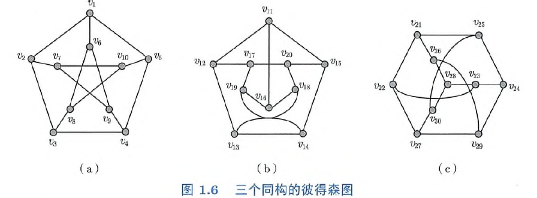

---
date:
  created: 2024-11-10
  updated: 2024-11-10
comments: true
---

# 图论笔记（八）

# 边的独立、覆盖与支配

## 定义

### 独立
**边独立集**：匹配  
**极大边独立集**：极大匹配  
**最大边独立集**：最大匹配  
**边独立数**：最大边独立集的大小，记作 $\alpha'(G)$

### 覆盖
**边覆盖集**：边的所有端点组成的集合为顶点集 $V$  
**极小边覆盖集**：任何边覆盖集都不是该边覆盖集的真子集  
**最小边覆盖集**：边数最少的边覆盖集  
**边覆盖数**：最小边覆盖集的大小，记作 $\beta'(G)$  

### 支配
对于图 $G = \langle V, E\rangle$ 和边子集 $D' \subseteq E$

- **边支配集**（edge dominating set）：任何 $D'$ 之外的边都与 $D'$ 中至少一条边相邻
- **极小边支配集**（minimal edge dominating set）：任何边支配集都不是该边支配集的真子集  
- **最小边支配集**（minimum edge dominating set）：边的数量最少的边支配集
- **边支配数**（edge domination number）：最小边支配集的大小，记作 $\gamma'(G)$

???+ note "思考题 8.1  每个图都有边独立集、边覆盖集、边支配集吗？"

    $K_1$ 没有边独立和边覆盖集，$E$ 是任何图的边支配集

???+ note "思考题 8.2  图 1.6（a）所示的彼得森图的边独立数、边覆盖数、边支配数分别是多少？"

    
    边独立数：5（$\{v_1 v_6, v_2 v_7, v_3 v_8, v_4 v_9, v_5 v_{10}\}$）
    边覆盖数：5（$\{v_1 v_6, v_2 v_7, v_3 v_8, v_4 v_9, v_5 v_{10}\}$）
    边支配数：4（$\{v_1 v_6, v_7 v_10, v_3 v_8, v_4 v_9\}$）

???+ note "思考题 8.3  阶为 $n$ 的图的边独立数的上界是多少？边覆盖数的下界是多少？边支配数的下界是多少？"

    边独立数 $\leq \lfloor n / 2 \rfloor$，边覆盖数 $\geq \lceil n / 2 \rceil$，边支配数 $\geq 1$（$m \geq 1$）

???+ note "思考题 8.4  完全图 $K_n$ 的边独立数、边覆盖数、边支配数分别是多少？"

    $\lfloor n / 2 \rfloor, \lceil n / 2 \rceil, \lfloor n / 2 \rfloor$

???+ note "思考题 8.5  完全二分图 $K_{m, n}$ 的边独立数、边覆盖数、边支配数分别是多少？"

    $\min\{m, n\}, \max\{m, n\}, \min \{m, n\}$

???+ note "思考题 8.6  边独立集、极小边覆盖集、极小边支配集的边导出子图的每个连通分支分别有什么特征？"

    边独立集：每个连通分支均为一条边  
    极小边覆盖集：直径小于等于 2    
    极小边支配集：直径小于等于 2  

???+ tip "定理 8.1"

    对于任意一个不含孤立点的图 $G$：
    $$
    \alpha'(G) \leq \beta'(G)
    $$

???+ note "思考题 8.7  证明定理 8.1"

    $$
    \alpha'(G) \leq \lfloor n / 2 \rfloor \leq \lceil n / 2 \rceil \leq \beta'(G)
    $$

???+ note "思考题 8.8  若图 $G$ 的一个边独立集和一个边覆盖集的大小相等，则能得出什么结论？"

    上一题中的不等号全部取等，即 $G$ 有完美匹配

???+ tip "定理 8.2"

    对于任意一个不含孤立点的图G：
    $$
    \alpha'(G) + \beta'(G) = \nu(G)
    $$

???+ note "思考题 8.9 证明定理 8.2"

    设 $M$ 为最大匹配，对于任意一个未匹配的点选取一条与之关联的边加入 $M$，最后得到 $L$ 为边覆盖集，我们有
    $$
    \alpha'(G) = |M| = \nu(G) - |L| \leq \nu(G) - \beta'(G)
    $$
    设 $L'$ 为最小边覆盖集，在 $G[L']$ 的每个连通分支中取一条边组成匹配 $M'$，由于每个连通分支直径小于 2，其形状成星形，有
    $$
    \nu(G) = |M'|+|L'| = |M'| + \beta'(G) \leq \alpha'(G) + \beta'(G)
    $$
    因此
    $$
    \alpha'(G) + \beta'(G) = \nu(G)
    $$

???+ abstract "推论 8.1"

    对于任意一个不含孤立点的图 $G$，$\alpha'(G) = \beta'(G)$ 当且仅当 $G$ 有完美匹配。

???+ note "思考题 8.10 证明推论8.1。"

    **充分性**：若 $G$ 有完美匹配 $M$，则 $M$ 既是匹配又是边覆盖集，于是
    $$
    |M| \leq \alpha'(G) \leq \beta'(G) \leq |M|
    $$
    故 $\alpha'(G) = \beta'(G)$  
    **必要性**：若 $\alpha'(G) = \beta'(G)$，则 $\alpha'(G) = \beta'(G) = \frac{\nu(G)}{2}$ 说明最大匹配就是完美匹配

???+ "思考题 8.11  边独立集是边支配集吗？极大边独立集是边支配集吗？"

    边独立集不一定是边支配集，而极大边独立集 $M$ 一定是边支配集，否则存在一条边 $e$ 不与 $M$ 中任何一条边相邻，那么 $M \cup \{e\}$ 也是边独立集，与极大矛盾

???+ tip "定理 8.3"

    对于任意一个图G:
    $$
    \alpha'(G) \geq \gamma'(G)
    $$

???+ "思考题 8.12 证明定理 8.3"

    设 $|M|$ 为最大匹配，则 $M$ 也是边支配集，于是
    $$
    \alpha'(G) = |M| \geq \gamma'(G)
    $$

???+ tip "定理 8.4"

    对于任意一个图，存在一个最小边支配集是极大边独立集

???+ abstract "推论 8.2"

    对于任意一个图，边支配数是最小的极大边独立集包含的边数

???+ note "思考题 8.13 证明定理 8.4 和推论 8.2"

    **定理 8.4 证明**：  
    **推论 8.2 证明**：